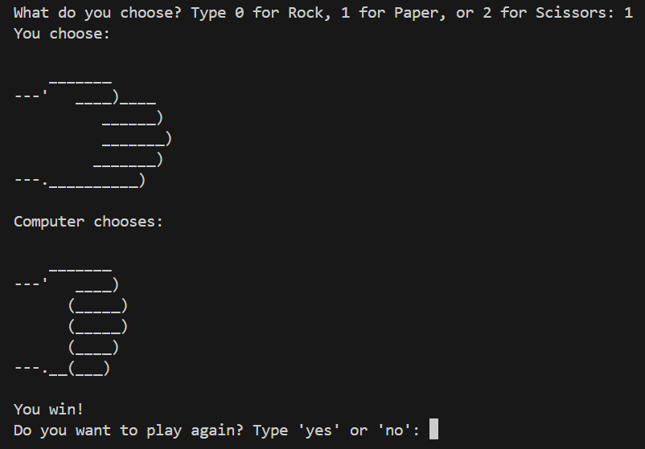

# ROCK PAPER SCISSORS

A terminal game built with Python and enhanced with some ASCII art. Feel free to play!

## How to Play

To play, just open the file `playRPS.bat`. Enjoy the classic game of Rock Paper Scissors with a fun visual twist!

## Game Preview

## Running the Game

1. **Download the Game Folder**: Clone or download the repository.
2. **Run the Game**: Double-click the `playRPS.bat` file to open the game in your terminal.
3. **Follow the Instructions**: Choose Rock, Paper, or Scissors and see if you can beat the computer.
4. **Enjoy**: Have fun playing and see how many times you can win!

